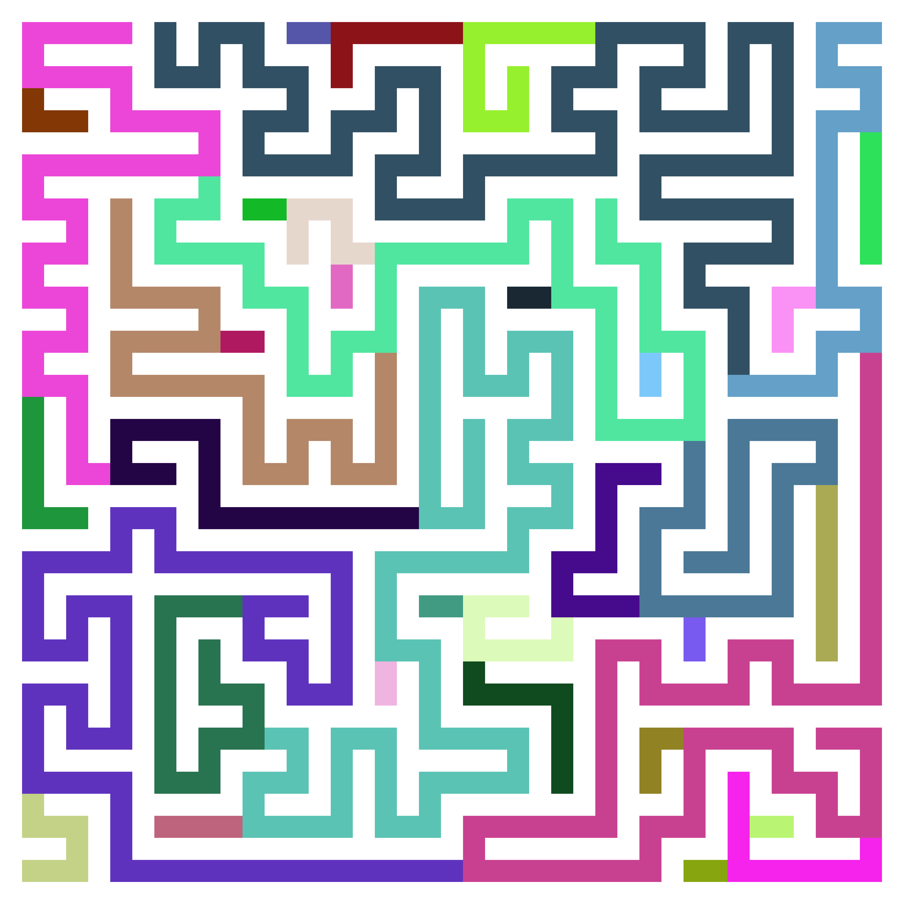

# Threads_Labyrinth

  This program generates a randomized maze and solves it using a multi-threaded traversal algorithm. The maze is visualized in the console and saved as a .ppm image file. Each thread marks its path within the maze, producing a unique color in the output image for each thread path.

# Features

<ul>
<li><b>Maze Generation</b></li>

Generates a randomized maze using depth-first search.
<li><b>Multi-threaded Maze Traversal</b></li>
  

    Explores the maze using concurrent threads, with each thread marking its path to showcase parallel traversal.
  

<li><b>Visualization</b></li>

Outputs a PPM image file representing the maze and traversal paths.

</ul>

# Process Overview
<h4>Maze Generation</h4>
A randomized maze is generated using depth-first search. The result is a grid of cells with open paths and walls, ensuring that all cells are reachable from at least one entry point.
<h4>Multi-Threaded Traversal</h4>
Starting from a random open cell, the program launches a thread to explore potential paths. When a thread encounters multiple open paths, it forks by creating new threads for each path while continuing its own exploration. This strategy enables simultaneous exploration of different sections of the maze.
<h4>Thread Synchronization</h4>
To prevent conflicts, each cell in the maze has a lock (mutex) that restricts access to a single thread at a time. This ensures that each cell is marked accurately with the unique ID of the thread that visited it, avoiding data corruption from simultaneous access.
<h4>End Condition and Termination</h4>
Each thread continues exploring until it reaches a dead end where no unvisited neighboring cells are available. When all paths are exhausted, the program ends with a fully marked maze.

# Visualization and Output

#### To compile this program in the Linux terminal, use the following command:
`g++ -std=c++11 -pthread -o App App.cpp`
<ul>
   <li>-std=c++11 : Specifies the use of the C++11 standard.</li>
   <li>-pthread : Enables multi-threading, allowing the program to run more efficiently when working with large matrices.</li>
</ul>

The completed maze, along with the distinct paths taken by each thread, is saved as a .ppm image file. Each path is represented by a unique color based on the thread ID, providing a clear visual of concurrent traversal and thread-distributed exploration. Walls appear as solid colors, while paths display in contrasting colors to emphasize the exploration routes taken by different threads.

# Maze walls have white color RGB(255,255,255)

# Benefits of Multi-Threaded Maze Solving
Multi-threaded traversal is significantly faster than a single-threaded approach, especially in large mazes, as it allows multiple paths to be explored at once. This method is also valuable for visualizing and teaching concepts related to parallel computing, thread synchronization, and concurrent search algorithms. Practical applications for this approach extend to robotics navigation, network pathfinding, and simulation of multi-agent systems. This task showcases efficient parallel processing and provides a strong foundation for applications requiring concurrent exploration and distributed pathfinding in complex environments.

